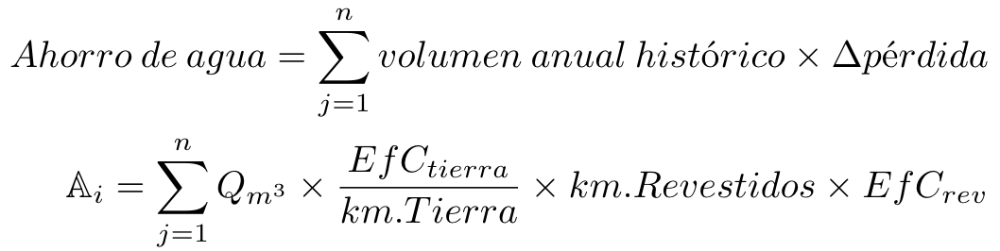

Propuesta para revisión del Fondo Potrerillos
========================================================
date: 17 December, 2020
autosize: true

Fondo Potrerillos
========================================================

- Las obras de infraestructura de impermeabilización de canales se traducen a una disminución en las pérdidas por filtración en el trazado del sistema hídrico del río Mendoza. 

- Estas mejoras se interpretan como aumentos en la eficiencia de conducción (**EfC**) por kilómetro de la unidad de manejo (**UM**). 

- Según los análisis actuales, la ganancia en EfC varía entre 10-22% dentro de la cuenca. 

- Se utilizaron los datos revisados y actualizados de caudales y eficiencias para los cálculos económicos.

Metodología
===

Información utilizada por código de cauce (DGI, 2004):
  - Volumen histórico entregado por hectárea productiva (DGI, 2016)
  - Eficiencia de conducción o valor representativo de la UM (Cuneo *et al.*, 2016)
  - Costo de la inversión en revestimiento y longitud revestida (2017-2020)

Resultados Río Mendoza
===

- Río Mendoza: el precio medio por m3 ahorrado es \$ 29.4 (USD 
0.335)

- El mismo fue calculado para superficie productiva por cauce

- Este valor permite un aumento en la disponibilidad de 
5.291 Hm3/año

- El Fondo Potrerillos puede actualizarse anualmente

Curva de ahorro
====

